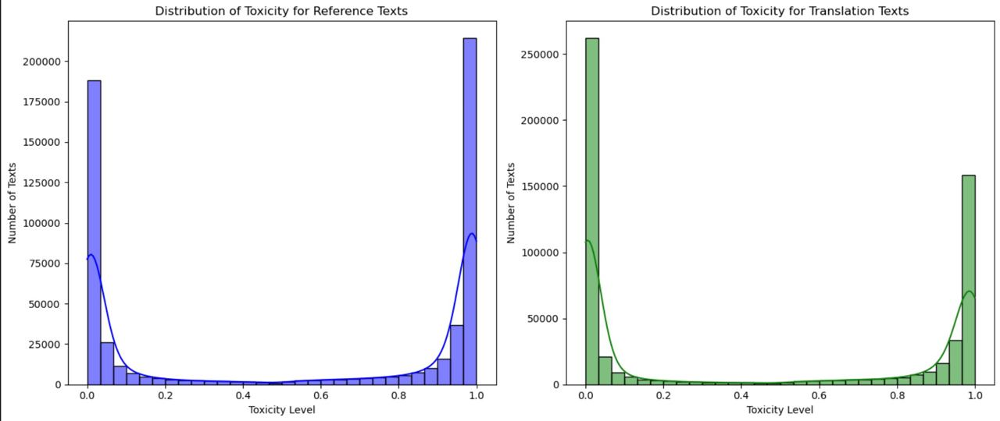
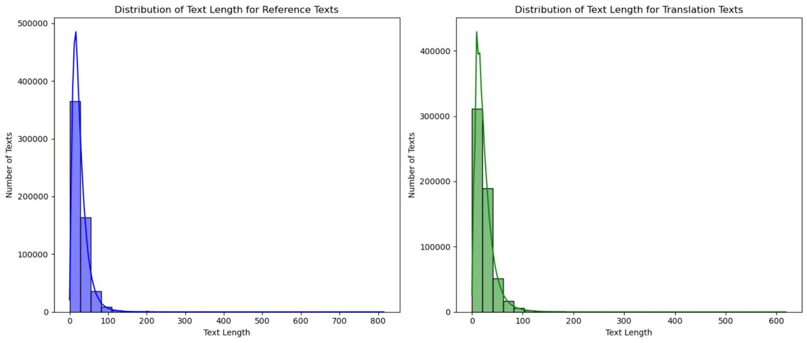
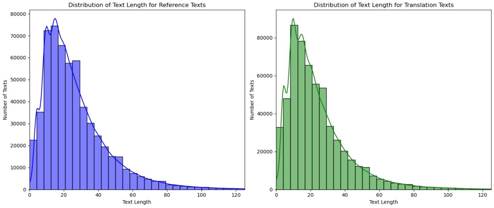
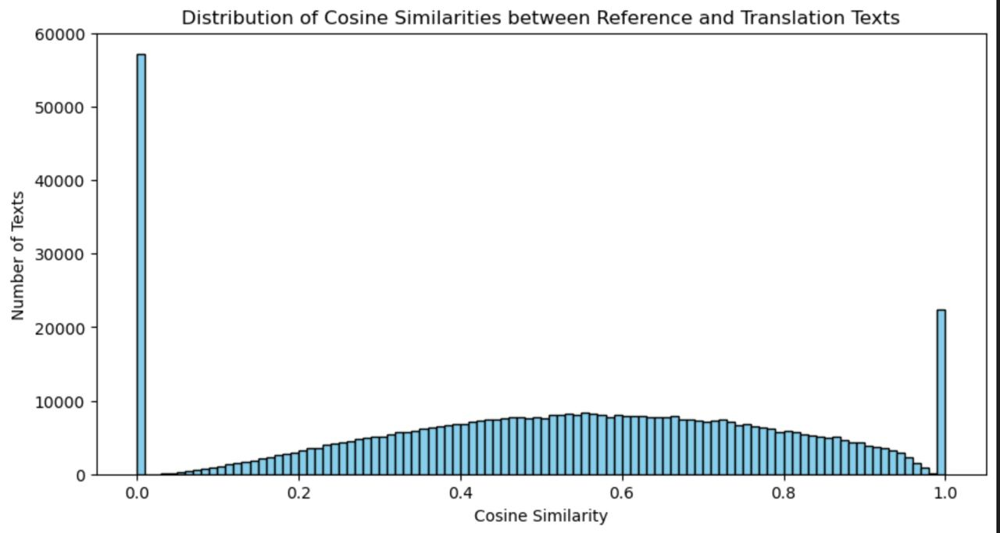
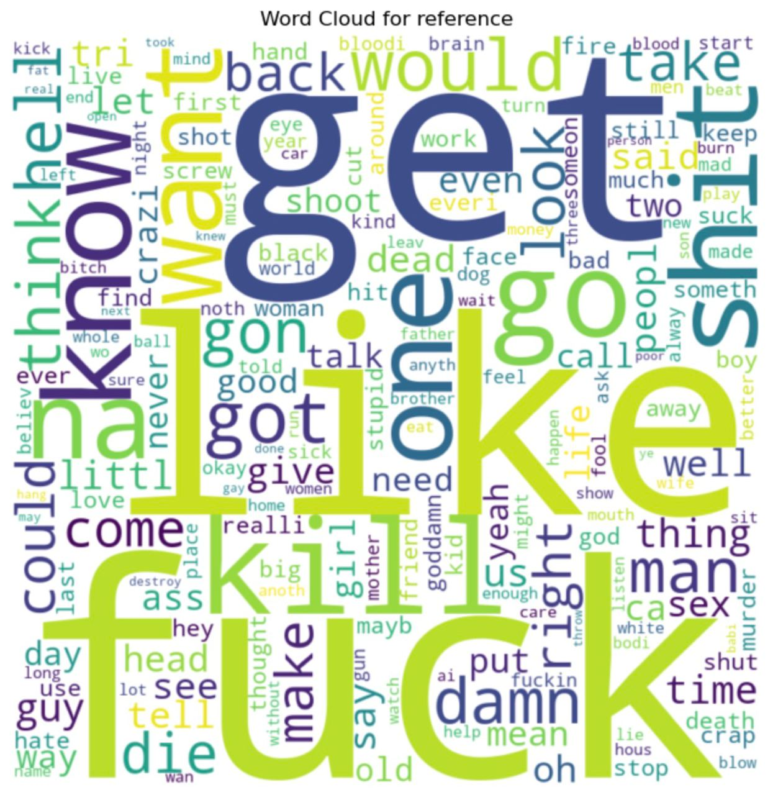
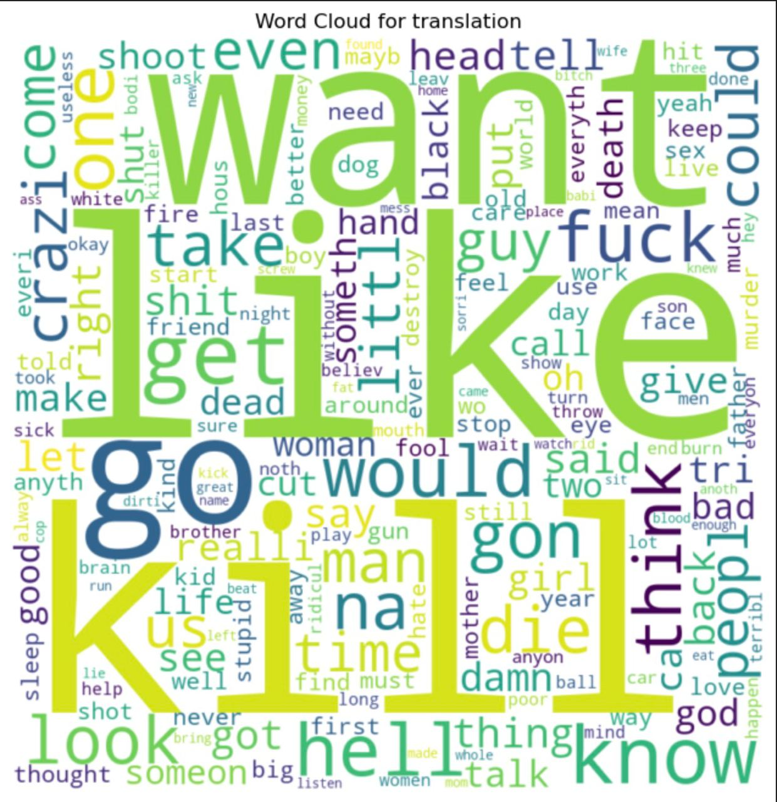

# Final Solution Report

## Introduction

The objective of this project is to create a model capable of translating toxic sentences into non-toxic ones without altering the original meaning. This report documents the process from data analysis through model training to the evaluation of results.

## Data Analysis

After acquiring the raw dataset, the first step was to analyze its characteristics to better understand the content we would be working with. The analysis involved examining the distribution of toxicity levels, text lengths, and word usage within the texts.

### 1) Distribution of Toxicity

</img>

#### Insights

##### Distribution of Toxicity for Reference Texts

- Most reference texts were found to be non-toxic, with a significant peak indicating low toxicity levels.
- There was a steep decline in the number of texts as toxicity levels increased.

##### Distribution of Toxicity for Translation Texts

- Translation texts followed a similar pattern, suggesting that translations maintain the non-toxic nature of the references.
- There was a more gradual decline in text frequency as toxicity increased compared to reference texts.

##### General Observations

- Both distributions were right-skewed, with an overwhelming presence of low-toxicity texts.
- This skewness might reflect the data collection methodology or the inherent properties of the source material.

### 2) Text Lengths

</img>

For a [0-128] range:

</img>

#### Insights

##### Distribution of Text Length for Reference Texts

- The peak around 40 characters indicates a common text length for reference sentences.
- Few texts were longer than 100 characters.

##### Distribution of Text Length for Translation Texts

- Translation texts had a slightly more varied length distribution but showed a similar peak around 40 characters.
- Again, texts longer than 100 characters were rare.

##### General Observation

- The right-skewed distribution in both cases suggests a common structure in the dataset, possibly due to the nature of the texts or collection methods.

### 3) Cosine Similarity Distribution

</img>

#### Insights

- A significant peak at 0 cosine similarity raised concerns about translations not matching the reference texts.
- A uniform distribution between 0.2 to 0.8 cosine similarity suggested varying degrees of translation quality.
- A peak near 1 cosine similarity could indicate high translation quality or a lack of paraphrasing, depending on the context.

### 4) Word Clouds

</img>

</img>

#### Insights

1. Dominant words like "man," "think," and "know" were common in both reference and translation texts.
2. Words related to dialogue and interpersonal interactions were frequent, hinting at the narrative nature of the texts.
3. The reference texts contained more aggressive terms, while the translations seemed to include more varied vocabulary.
4. The presence of colloquial terms indicated the inclusion of informal language in the datasets.

## Model Specification

For this project, we chose to implement Hypothesis #2, constructing a Seq2Seq model utilizing LSTM networks due to prior experience and familiarity with the architecture and ease of implementation. This model captures the sequential nature of language, making it well-suited for tasks involving translation or paraphrasing while preserving the meaning.

## Training Process

Given the constraints of the hardware at hand—an Apple M1 Pro with 16GB RAM—it was determined that training the model on the entire dataset would take approximately 14 hours. To expedite the training process, the dataset was reduced to half its size, which allowed for the training to be completed in around 6 hours.

## Evaluation

During the evaluation phase, we employed widely recognized metrics to assess the model's performance. These metrics include BLEU for precision in translation, and ROUGE-1 and ROUGE-L for measuring the overlap between the model's output and the ground truth in terms of unigrams and longest common subsequences respectively.

The evaluation revealed the following results:

- Average BLEU score: 0.039391276526298424
- Average ROUGE-1 score: 0.22633753009957291
- Average ROUGE-L score: 0.21869081536854712

These scores, particularly the BLEU score, which is low, suggest that the model's translations had limited overlap with the reference translations. It implies that while there might be some matching content, the precision and fluency of the translations could be substantially improved.

## Results

The final results of the training and validation process yielded a Training Loss of 5.950 with a Perplexity (PPL) of 383.619 and a Validation Loss of 6.201 with a Perplexity of 493.276.

The high perplexity values are indicative of the model's uncertainty in predicting the next word in the sequence, which is a reflection of the model's ability to handle the complexity of language translation. These figures underline the challenges faced by the model in learning an effective mapping from the input sequences to the output sequences.

### Limitations and Considerations

- The model was trained only on half of the dataset due to time constraints, which might have limited its exposure to the full range of linguistic patterns and vocabulary needed for more accurate translations.
- Training for a single epoch might not have been sufficient for the model to converge and learn an optimal representation of the translation task.
- The architecture of a simple EncoderDecoder Sequence-to-Sequence model based on LSTMs may be too simplistic to capture the nuanced and context-dependent nature of language required for high-quality text detoxification.

### Conclusions

While the model does provide a baseline for text detoxification, the evaluation metrics indicate that there is significant room for improvement. The limitations due to training on a reduced dataset and for a limited number of epochs have likely impacted the model's performance. The architecture itself, while foundational, might not be sophisticated enough for the intricacies involved in text detoxification. Future work would involve expanding the training data, increasing the number of training epochs, and exploring more complex models such as Transformer-based architectures, which could potentially improve upon the results obtained from this LSTM-based model.

